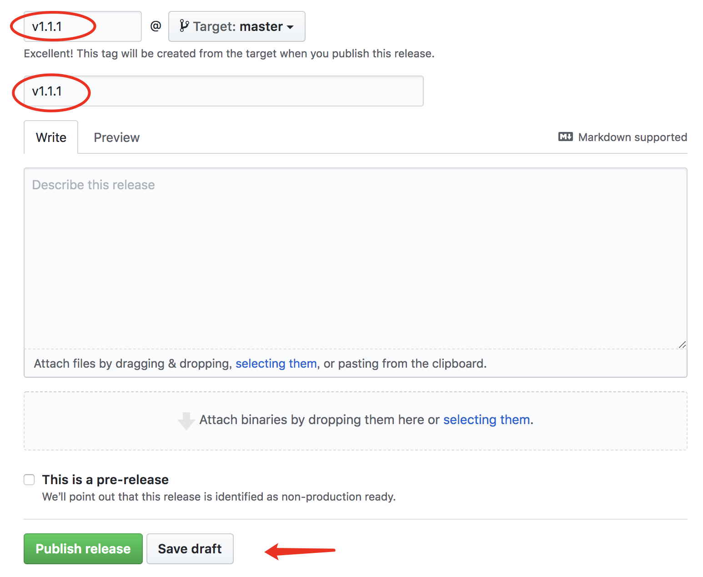
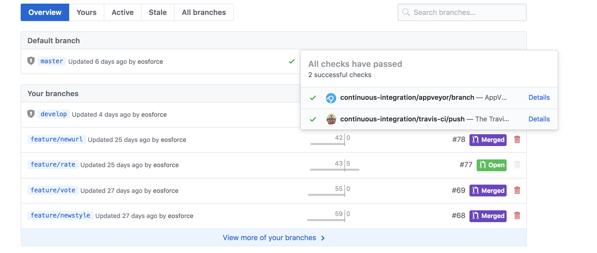

# 发布流程

关于构建和发布和更新的详细文档可以参见 [electron-builder](https://github.com/electron-userland/electron-builder)

## CI

在项目里有两个配置文件 `.travis.yml` 和 `appveyor.yml` 分别对应 `travis-ci` 和 `appveyor` 两个平台。

`travis-ci` 负责构建 `mac` 和 `linux` 的 app。`appveyor` 负责构建 `windows` 平台的 app。他们会监控 `master` 分支的代码，如果 `master` 有变更，就会开始构建任务。构建完成后，平台会检测 github releases 里面，是否有和 package.version 版本号相对应的 releases 的草稿，如果用则会自动上传构建好的文件到该草稿里面。

## 实际流程

当准备发布一个新版本的时候。

1. 按照语义化版本的规则，修改 develop 分支的 package 的版本号，例如 v1.1.1。
2. 在 github releases 增加 tag 为 v1.1.1 的 releases 草稿。tag 可以本地创建 push 到库里面，也可以直接通过 releases 创建。

3. 将 develop 合并到 master。此时平台会开始自动构建。可以在 branches 里面查看构建状态。

4. 当平台构建完成且上传全部结束后，找到 v1.1.1 的 releases 草稿。点击发布。

## 自动更新

v1.0.3 版本会检测 github release 是否有新版本发布。从而提示更新。v1.0.4 版本将会通过阿里云检查下载更新。

`autoUpdater.setFeedURL('https://updatewallet.oss-cn-hangzhou.aliyuncs.com/latest/');`

git releases 更新后，将所有文件下载下来，然后上传到 `https://updatewallet.oss-cn-hangzhou.aliyuncs.com/latest/` 这个目录即可。